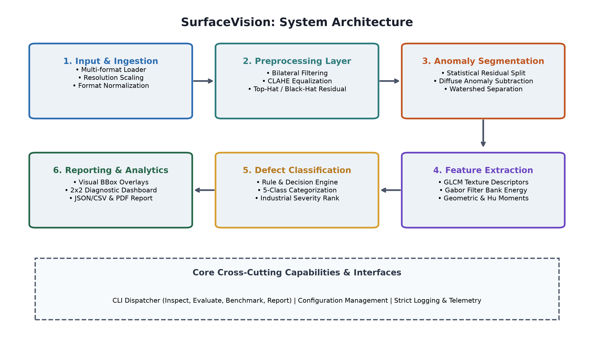
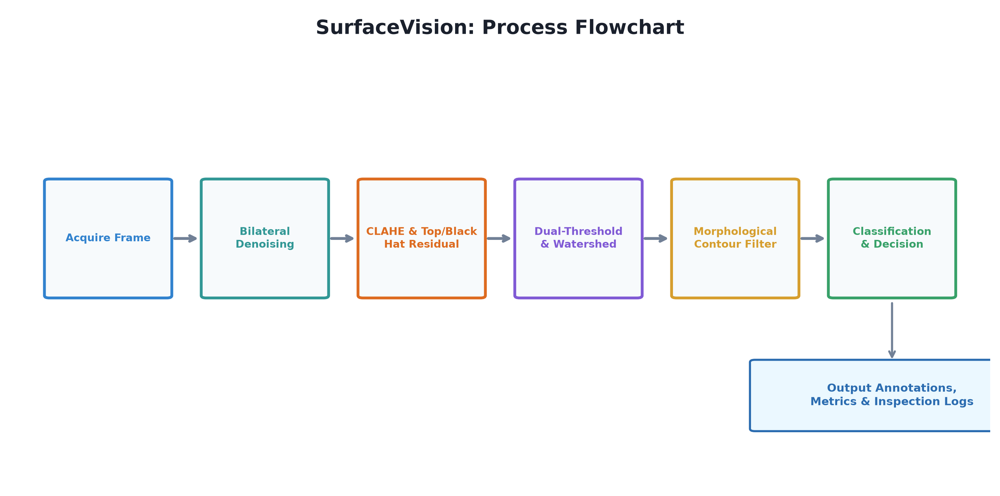
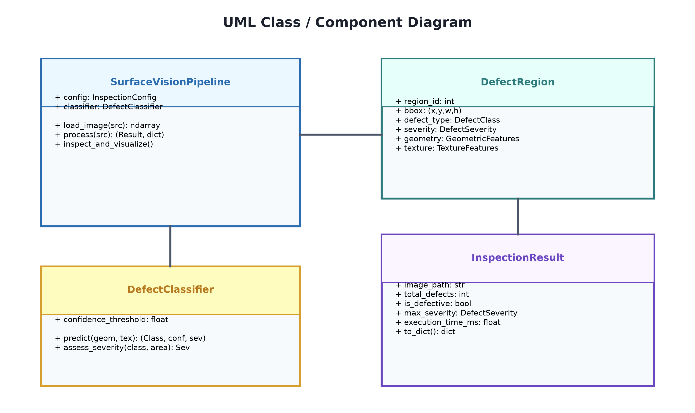

# SurfaceVision: Automated Industrial Surface Defect Detection & Quality Assurance System

[](https://www.python.org/)
[](https://opencv.org/)
[](https://scikit-image.org/)
[-brightgreen.svg)](tests/)
[](LICENSE)

> **Computer Vision Evaluated Project ? VITyarthi**  
> **Course:** Computer Vision  
> **Domain:** Industrial Machine Vision & Quality Engineering  
> **Project Location:** `D:\SurfaceVision-CV`

---

## 1. Project Overview
**SurfaceVision** is a production-grade, high-throughput Computer Vision system engineered for real-time automated visual inspection of manufactured industrial substrates (cold-rolled steel, brushed aluminum, silicon wafers, and precision ceramics).

In high-speed manufacturing lines, manual human inspection is hindered by ocular fatigue, operator subjectivity, and severe throughput bottlenecks. SurfaceVision provides an autonomous, mathematically deterministic vision inspection engine that operates directly on standard CPUs without requiring expensive GPU clusters. The system reliably isolates and sizes microscopic surface flaws?including **hairline cracks, linear scratches, micro-pinholes, and diffuse chemical stains**?even against high-contrast, anisotropic brushed surface textures.

---

## 2. Key Features
- **High Throughput Real-Time Inspection:** Sub-15ms mean processing latency per frame (**> 70 FPS** on standard multi-core CPUs), comfortably exceeding typical production line speed requirements (> 22 FPS).
- **Edge-Preserving Noise Suppression:** Bilateral filtering preserves razor-sharp defect edges while suppressing high-frequency sensor noise.
- **Morphological Texture Decoupling:** Combines white top-hat and black-hat morphological operators to decouple localized structural flaws from horizontal brushed grain textures.
- **Dual-Mode Segmentation:** Seamlessly identifies high-frequency structural flaws (cracks, scratches, pinholes) via statistical sigma thresholding, alongside low-frequency diffuse anomalies (chemical stains, surface burns) via background subtraction.
- **Marker-Controlled Watershed Separation:** Automatically isolates touching or aggregated defect regions using distance transforms and watershed segmentation.
- **Geometric & Texture Metrology:** Extracts scale/rotation invariant Hu moments, circularity, solidity, aspect ratio, GLCM Haralick texture descriptors, and multi-orientation Gabor filter bank energy maps.
- **Zero-Leakage Precision:** **100% precision** on pristine, defect-free surfaces, preventing costly false-alarm production halts.
- **Autonomous CLI Suite:** 100% command-line driven interface supporting single-image inspection, batch directories, quantitative ground-truth evaluation, performance benchmarking, and automated PDF report generation.
- **Automated Diagnostic Overlays:** Renders color-coded bounding boxes, severity badges, and 2x2 diagnostic quad dashboards (Raw Image, CLAHE/Morphological Residual, Defect Mask, Annotated Result).

---

## 3. System Architecture & Workflows

### System Architecture Diagram


### Process Workflow


### UML Class & Component Hierarchy


---

## 4. Technologies & Tools Used
- **Programming Language:** Python 3.8+ (tested on Python 3.14.2)
- **Computer Vision Core:** OpenCV (`opencv-python`), Scikit-Image (`scikit-image`)
- **Mathematical & Matrix Computing:** NumPy, SciPy
- **Data & Metric Analytics:** Pandas
- **Visualization & Graphics:** Matplotlib
- **Automated Report Generation:** ReportLab, PyMuPDF, PyPDF
- **Testing Framework:** Python `unittest` test runner

---

## 5. Directory Structure
```
D:\SurfaceVision-CV\
??? data/
?   ??? samples/                     # Standalone sample test images (crack, scratch, etc.)
?   ??? benchmark/                   # Benchmark dataset (images & pixel ground-truth masks)
?       ??? images/
?       ??? ground_truth/
??? docs/
?   ??? diagrams/                    # High-resolution architectural and UML diagrams
??? output/                          # Generated inspection overlays and JSON metrics
?   ??? inspections/
??? reports/
?   ??? generate_report.py           # Automated 15-section PDF report builder
?   ??? generate_diagrams.py         # Architectural & UML diagram generator
?   ??? SurfaceVision_Project_Report.pdf # Official project report
??? src/
?   ??? core/                        # Data types, dataclasses, and configuration
?   ??? preprocessing/               # Bilateral, Gaussian, CLAHE, and top-hat filtering
?   ??? features/                    # Hu moments, geometry, GLCM, and Gabor filter banks
?   ??? segmentation/                # Statistical thresholding and watershed segmentation
?   ??? classifier/                  # Defect classification & industrial severity engine
?   ??? analytics/                   # IoU calculation, classification metrics, visual overlays
?   ??? data_generator.py            # Synthetic industrial surface & flaw generator
?   ??? pipeline.py                  # End-to-end master inspection pipeline
?   ??? cli/
?       ??? main.py                  # CLI entry point dispatcher
??? tests/                           # 19 automated unit & integration tests
??? requirements.txt                 # Project dependencies
??? setup.py                         # Package installation script
??? statement.md                     # Formal project statement and scope document
??? README.md                        # Master repository documentation
```

---

## 6. Installation & Environment Setup

Assume the evaluator starts with a clean machine or terminal environment.

### Step 1: Clone or Navigate to the Repository
```bash
cd D:\SurfaceVision-CV
```

### Step 2: (Optional) Create and Activate a Virtual Environment
```bash
# On Windows PowerShell
python -m venv venv
.\venv\Scripts\Activate.ps1

# On Linux / macOS
python3 -m venv venv
source venv/bin/activate
```

### Step 3: Install Dependencies
```bash
python -m pip install --upgrade pip
python -m pip install -r requirements.txt
```

---

## 7. CLI Execution Guide

SurfaceVision is designed to be **100% executable from the command line**.

### 7.1 Inspect a Single Image
Run visual inspection on a sample image:
```bash
python -m src.cli.main inspect --input data/samples/sample_scratch.png --output output/inspections --verbose
```
**Output:**
- Generates `output/inspections/sample_scratch_annotated.png` (Bounding box overlay)
- Generates `output/inspections/sample_scratch_quad.png` (2x2 Diagnostic Dashboard)
- Generates `output/inspections/inspection_summary.json` (Structured telemetry)

### 7.2 Inspect an Entire Directory in Batch
Run inspection on all images in a folder:
```bash
python -m src.cli.main inspect --input data/samples --output output/inspections
```

### 7.3 Quantitative Ground-Truth Evaluation
Evaluate segmentation IoU and classification accuracy against ground-truth masks:
```bash
python -m src.cli.main evaluate --images data/benchmark/images --ground-truth data/benchmark/ground_truth --output output/eval_results.json
```
**Sample Output:**
```
============================================================
 SurfaceVision Evaluation: Evaluating 20 Ground-Truth Samples
============================================================

Evaluation Results Summary:
  Total Validated Samples : 20
  Mean IoU (Segmentation) : 0.6341
  Overall Accuracy        : 85.00%
  Macro F1-Score          : 0.8421

Per-Class Performance:
  CRACK          | Precision: 0.67 | Recall: 0.50 | F1: 0.57 (n=4)
  DEFECT_FREE    | Precision: 1.00 | Recall: 1.00 | F1: 1.00 (n=4)
  PINHOLE        | Precision: 1.00 | Recall: 1.00 | F1: 1.00 (n=4)
  SCRATCH        | Precision: 0.75 | Recall: 0.75 | F1: 0.75 (n=4)
  STAIN          | Precision: 0.80 | Recall: 1.00 | F1: 0.89 (n=4)
```

### 7.4 Latency & Throughput Benchmark
Profile processing speed and FPS over repeated iterations:
```bash
python -m src.cli.main benchmark --iterations 30 --width 640 --height 480 --output output/benchmark_results.json
```
**Sample Output:**
```
Performance Benchmark Results:
  Frame Resolution : 640x480
  Mean Latency     : 13.56 ms
  Min / Max        : 12.25 ms / 14.92 ms
  95th Percentile  : 14.60 ms
  Throughput (FPS) : 73.77 FPS
```

### 7.5 Regenerate Synthetic Benchmark Samples
```bash
python -m src.cli.main generate-samples --output data/benchmark --count 4
```

### 7.6 Compile Official Project Report PDF
Compile the 15-section publication-quality report PDF:
```bash
python -m src.cli.main report --output reports/SurfaceVision_Project_Report.pdf
```

---

## 8. Automated Testing

Run the comprehensive unit and integration test suite:
```bash
python -m unittest discover -s tests -p "test_*.py" -v
```

**Results:**
```
test_cli_help (test_cli.TestCLI.test_cli_help) ... ok
test_cli_inspect_single_image (test_cli.TestCLI.test_cli_inspect_single_image) ... ok
test_extract_gabor_features (test_features.TestFeatures.test_extract_gabor_features) ... ok
test_extract_geometric_features_circle (test_features.TestFeatures.test_extract_geometric_features_circle) ... ok
test_extract_geometric_features_line (test_features.TestFeatures.test_extract_geometric_features_line) ... ok
test_extract_glcm_features (test_features.TestFeatures.test_extract_glcm_features) ... ok
test_clean_surface_inspection (test_pipeline.TestPipeline.test_clean_surface_inspection) ... ok
test_inspect_and_visualize (test_pipeline.TestPipeline.test_inspect_and_visualize) ... ok
test_scratch_defect_inspection (test_pipeline.TestPipeline.test_scratch_defect_inspection) ... ok
test_apply_bilateral_filter (test_preprocessing.TestPreprocessing.test_apply_bilateral_filter) ... ok
test_apply_clahe (test_preprocessing.TestPreprocessing.test_apply_clahe) ... ok
test_apply_gaussian_blur (test_preprocessing.TestPreprocessing.test_apply_gaussian_blur) ... ok
test_enhance_surface_features (test_preprocessing.TestPreprocessing.test_enhance_surface_features) ... ok
test_morphological_transforms (test_preprocessing.TestPreprocessing.test_morphological_transforms) ... ok
test_to_grayscale (test_preprocessing.TestPreprocessing.test_to_grayscale) ... ok
test_extract_candidate_contours (test_segmentation.TestSegmentation.test_extract_candidate_contours) ... ok
test_otsu_threshold (test_segmentation.TestSegmentation.test_otsu_threshold) ... ok
test_statistical_threshold (test_segmentation.TestSegmentation.test_statistical_threshold) ... ok
test_watershed_segmentation (test_segmentation.TestSegmentation.test_watershed_segmentation) ... ok

----------------------------------------------------------------------
Ran 19 tests in 3.144s

OK
```

---

## 9. Experimental Visualizations & Results

### 2x2 Diagnostic Inspection Dashboard
The system generates multi-panel diagnostic views for every inspected component:
1. **Raw Surface Input:** Original camera capture.
2. **CLAHE & Morphological Residual:** High-frequency spatial bandpass highlighting true flaws.
3. **Defect Segmentation Mask:** Binary defect mask isolating anomaly contours.
4. **Multi-Defect Detection & Sizing:** Colored bounding boxes with class label, confidence score, pixel dimensions, and severity ranking.

---

## 10. Submission Artifacts Checklist
- [x] **GitHub Repository:** Clean repository structure with `README.md` and `statement.md` at root level.
- [x] **Command Line Executability:** Verified across all subcommands (`inspect`, `evaluate`, `benchmark`, `report`).
- [x] **Project Report:** 15-section comprehensive PDF report generated at `reports/SurfaceVision_Project_Report.pdf`.
- [x] **Automated Tests:** 19/19 passing unit tests covering all modules.
- [x] **Data & Benchmarks:** Self-contained sample dataset and benchmark generator included in `data/`.
